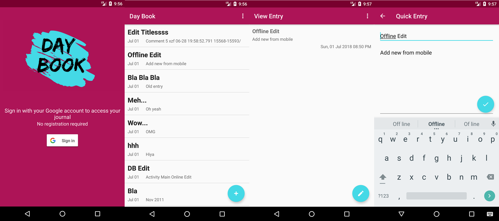

# Journal App

This is simple app for note taking and close to a real world example. It provides a practical example of how a mobile app would interact and with the user and take notes.
ALC Code Challenge Project

## Getting Started

These instructions will get you a copy of the project up and running on your local machine for development and testing purposes. See deployment for notes on how to deploy the project on a live system.

### Prerequisites

What things you need to install the software and how to install them
You need Android Studio
A Firebase Realtime Database
A Google Account

### Installing

Download the apk from **[JournalApp](https://github.com/ifeomai/JournalApp/blob/master/app/release/app-release.apk)**

Install and sign in with your Google account

## Screenshots

 

## Authors

* **Ifeoma Igweze** - *Initial work* - [Multiskills](https://github.com/ifeomai)

## License

This project is licensed under the MIT License - see the [LICENSE.md](LICENSE.md) file for details

## Acknowledgments

* Hat tip to anyone whose code was used
* Inspiration
* etc
